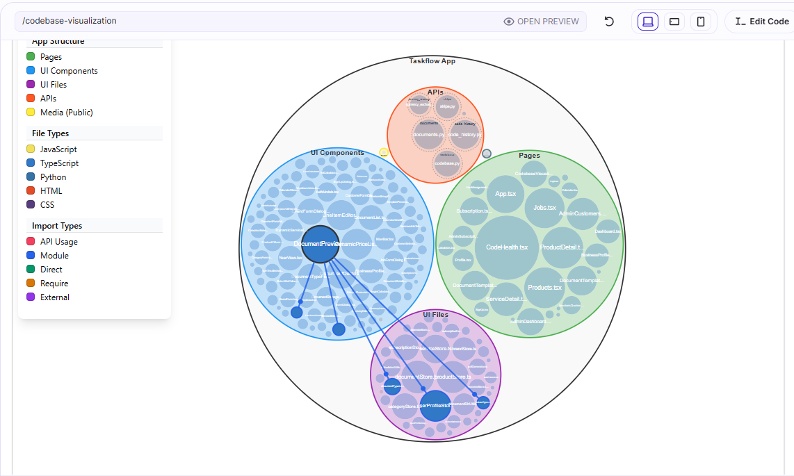

# Databutton Code Visualiser

## Overview
A plug-and-play code visualisation tool for Databutton apps that helps you visually inspect your codebase.

How to Add Codebase Visualiser to Your Application
Please reach out to Elle Neal on Discord to share your feedback or for any support using this tool. [Thread for feedback](https://discordapp.com/channels/821839120678125571/1350045417550909462/1350045417550909462)

This guide provides step-by-step instructions on adding the Codebase Visualiser template to your existing application. This template consists of three files: one page, one component, and one API endpoint. By following these steps, you'll be able to visualise your codebase with a simple refresh.

Important: The names of the page, component, and API MUST be the same. Ensure you set these three new files to Read-Only. 

Applying and using this template will consume 0 credits.

## Installation

### Task Instructions for Databutton Agent - TODO

### Manually Add Files
You can manually add these files to your own Databutton project. 

**Step 1: Add code to your Databutton Project**
1. Create a new page called `CodebaseVisualization`, click on the ellipses on the new page and click **'Set read-only for agent'**.
2. Click **'Edit Code'** Copy the code from this file [CodebaseVisualization.tsx](https://github.com/ElleNealAI/databutton-code-visualiser/blob/main/ui/pages/CodebaseVisualization.tsx) and replace the existing code.
3. 1. Create a new page called `CodebaseVisualizer`, click on the ellipses on the new page and click **'Set read-only for agent'**.
4. Click **'Edit Code'** Copy the code from this file [CodebaseVisualizer.tsx](https://github.com/ElleNealAI/databutton-code-visualiser/blob/main/ui/components/CodebaseVisualizer.tsx) and replace the existing code.
5. Create a new API called `codebase`, click on the ellipses on the new API and click **'Set read-only for agent'**.
6. Copy the code from this file [codebase.py](https://github.com/ElleNealAI/databutton-code-visualiser/blob/main/backend/codebase.py) and replace the existing code.

**Step 2: Run your report**
Navigate to the CodebaseVisualization page and click **'Refresh'**

This will trigger the API which will collect code health data about your Databutton application. A file will be created in Databutton storage called `codebase-snapshot-latest`
